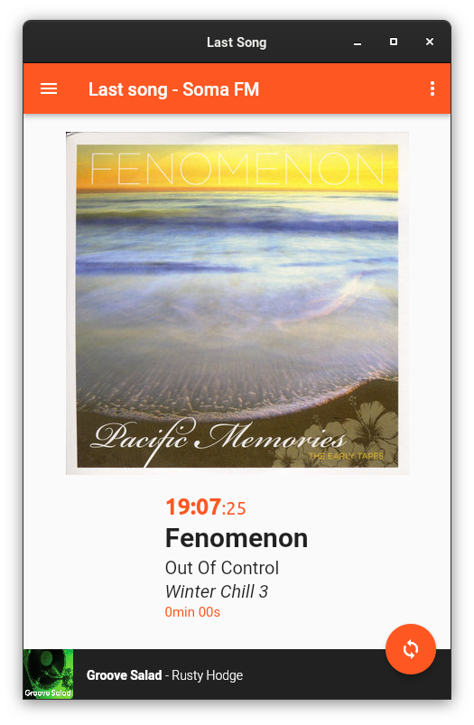

# Last Song

## An exercice to learn a bit Flutter

Get the *last track* played on a limited choice of radio channels. Currently **Radio Nova**, **Soma FM**, **BBC Radio One**.

**This does not play the radio** sound but just provide the information about the track/song played.

The info are fetched automatically every 30 seconds, but you can do it manually, if need be with the double arrow button, in the bottom right corner.

This is a *flutter* project able to run on Windows, Linux, on mobile (Android), MacOS. Use the `flutter-web.sh` script to run it in a browser.

When the website's radio does not provide cover image, the app makes a search on *bandcamp.com* for an image and track length, and if no result, then  a search on *discogs.com*

## Build and run

You need the *flutter* **SDK** installed with the dependancies of your platform; and then either use `flutter build <platform>` to create an executable/bundle or `flutter run`.

This has been currently tested on Windows 10, Linux, MacOS, and Android. There are binaries available as APK for android, *exe* in *zip* for Windows, *exe* in a *tar.gz* for Linux. MacOS binaries are coming.

## Extend

You can add any radio by creating a subclass to Channel and implement *fetchCurrentTrack* (and optionnaly *getRecentTracks*, and *getCurrentShow*).
If no image is provided by the radio website, you can search *bandcamp.com* with the searchBandcamp function.

Add it to *ChannelManager.initialize()* to populate the list of radios.

Then, you can send us a Pull Request (?) so that that radio can be included.
